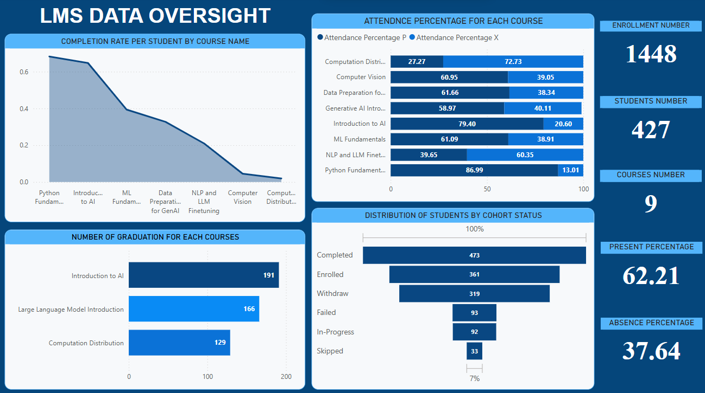

# 📊 LMS Data Oversight Dashboard

This repository presents a **Learning Management System (LMS)** data governance and analysis project. It leverages **Power BI**, **MySQL**, and **Python** to process, analyze, and visualize key LMS metrics like attendance, completion rates, and student cohort status.

## 🚀 Project Overview

This Capstone project was developed to address critical gaps in an LMS system that was initially deployed under tight deadlines. The platform suffered from inconsistent data, poor reporting, and lack of governance.

### 🎯 Objectives

- Improve data quality (cleaning, merging, formatting)
- Enable real-time analytics using Power BI
- Implement data governance principles (security, consistency)
- Support informed decision-making

---

## 🛠 Tech Stack

- **SQL (MySQL)**: Data cleaning, transformation, analysis
- **Python**: File merging, preprocessing
- **Power BI**: Visualization, DAX measures, dashboarding

---

## 📂 Data Sources

- Student attendance logs (CSV/TSV)
- Cohort assignments, schedules, change logs
- Student enrollment and status records

---

## 🔄 Data Preprocessing Steps

- Merged all attendance logs using Python
- Removed duplicates via `DISTINCT`
- Standardized date format with `DATE_FORMAT()`
- Trimmed whitespaces using `TRIM()`
- Combined tables using `UNION`
- Loaded everything into MySQL

---

## 📊 Key Visuals

### ✅ Completion Rate by Course
- Highest: Python, Intro to AI
- Lowest: Computer Vision, Distribution Computation

### 🧍‍♀️ Student Status Breakdown
- **Completed**: 473
- **Enrolled**: 361
- **Withdrawn**: 319

### 🕐 Attendance Distribution
- Best Attendance: Python Fundamentals (86.99%)
- Worst Attendance: Distribution Computation (27.27%)

### 🎓 Graduation Count
- Top course: **Intro to AI** with 191 completions

---

## ⚠️ Problems & Fixes

| Issue | Solution |
|-------|----------|
| Inconsistent formats | Standardized all formats (e.g., dates) |
| Manual file sharing | Created uniform naming and storage rules |
| Data inconsistency | Centralized DB + clear ETL process |

---

## 📈 Insights

- High dropout/absence in Distribution Computation = review content difficulty
- Strong engagement in Python and Intro to AI = double down on popular topics
- Recommend adjusting schedules to avoid holidays

---
## ✅ Conclusion

This project reinforced the importance of structured data governance in educational platforms. It proved how cleaning, analyzing, and visualizing can reveal actionable trends to enhance learning outcomes and operational efficiency.

---

## 📌 Authors
- Group 6  
Seham Salman,
Nawal Mohammad,
Wasmia Al-Mutiri,
Asma Al-Ghamdi.
